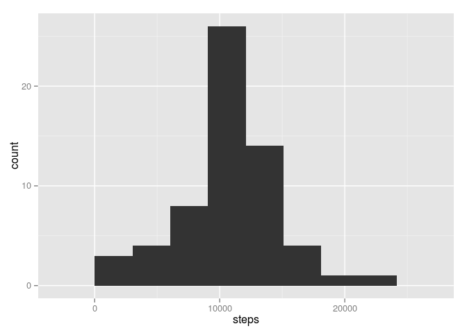

# Reproducible Research: Peer Assessment 1


## Loading and preprocessing the data

1. Load the data (i.e. read.csv())

```r
unzip("activity.zip")
activity <- read.csv("activity.csv", header = TRUE)
```

2. Process/transform the data into a format suitable for your analysis - converting the date to the proper format.

```r
activity$date <- as.Date(activity$date)
```


## What is mean total number of steps taken per day?

1. The total number of steps taken per day


```r
library(plyr)
activity_day <- ddply(activity, .(date), summarize, steps = sum(steps, na.rm = FALSE))
```

2. Histogram of the total number of steps taken each day


```r
library(ggplot2)
bw <- diff(range(activity_day$steps, na.rm = TRUE))/7
qplot(steps, data=activity_day, geom="histogram", binwidth = bw)
```

 

3. The mean and median of the total number of steps taken per day are


```r
mean(activity_day$steps, na.rm = TRUE)
```

```
## [1] 10766.19
```

```r
median(activity_day$steps, na.rm = TRUE)
```

```
## [1] 10765
```


## What is the average daily activity pattern?

1. Time series plot of the 5-minute interval (x-axis) and the average number of steps taken, averaged across all days (y-axis)


```r
activity_interval <- ddply(activity, .(interval), summarize, steps = mean(steps, na.rm = TRUE))
qplot(interval, steps, data = activity_interval, geom = "line")
```

 

2. The 5-minute interval, on average across all the days in the dataset, which contains the maximun number of steps is 0835.

## Imputing missing values

1. The total number of missing values in the dataset (i.e. the total number of rows with NAs) is


```r
sum(is.na(activity$steps))
```

```
## [1] 2304
```

2. Strategy for filling in all of the missing values in the dataset - for the missing values the mean for the corresponding interval is calculated and the missing value is replaced with it.


```r
impute.mean <- function(x) replace(x, is.na(x), mean(x, na.rm = TRUE))
```

3. A new dataset that is equal to the original dataset but with the missing data filled in is created.


```r
activity_imp <- ddply(activity, ~ interval, transform, steps = impute.mean(steps))
activity_imp <- activity_imp[order(activity_imp$date, activity_imp$interval), ]
```
4. Histogram of the total number of steps taken each day. 


```r
activity_day <- ddply(activity_imp, .(date), summarize, steps = sum(steps))
qplot(steps, data=activity_day, geom="histogram", binwidth = bw)
```

 

The mean and median total number of steps taken per day


```r
mean(activity_day$steps)
```

```
## [1] 10766.19
```

```r
median(activity_day$steps)
```

```
## [1] 10766.19
```

The value of the mean remains exactky the same (due to the method of imputing missing values I chose), the median changes slightly.

## Are there differences in activity patterns between weekdays and weekends?

1. A new factor variable is created in the dataset with two levels – “weekday” and “weekend” indicating whether a given date is a weekday or weekend day.


```r
activity_imp$wd <- as.factor(ifelse((weekdays(activity_imp$date) == "Saturday" | weekdays(activity_imp$date) == "Sunday"), "weekend", "weekday"))
```

2. Panel plot containing a time series plot of the 5-minute interval (x-axis) and the average number of steps taken, averaged across all weekday days or weekend days (y-axis)


```r
activity_di <- ddply(activity_imp, .(interval, wd), summarize, steps = mean(steps, na.rm = TRUE))
ggplot(data = activity_di, aes(interval, steps)) + geom_line() + facet_grid(wd ~ .)
```

 
